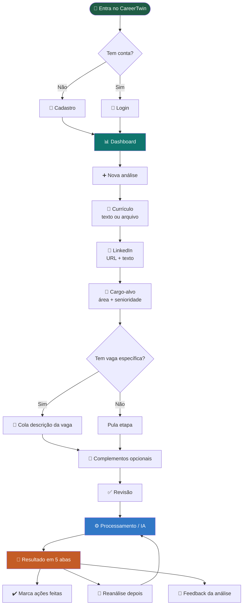
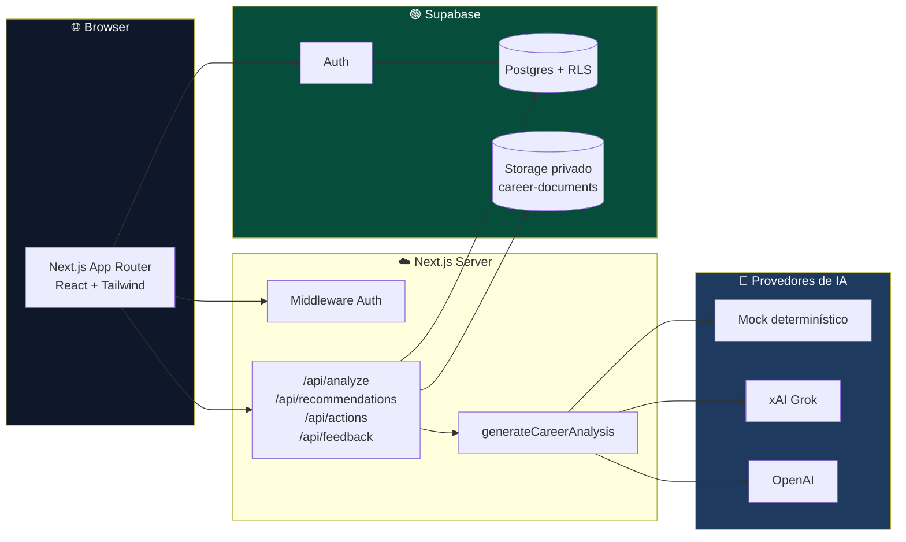
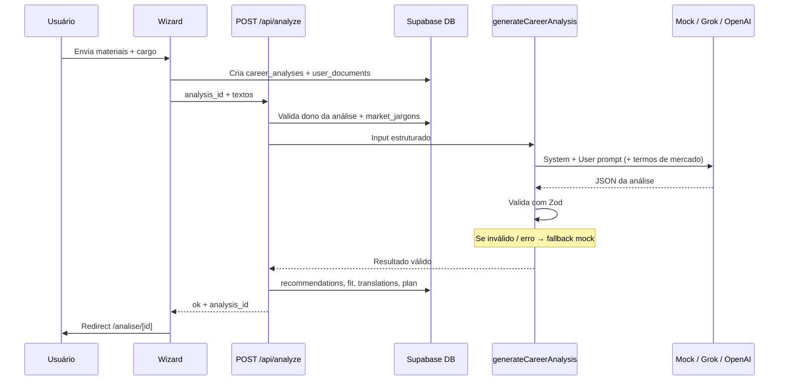
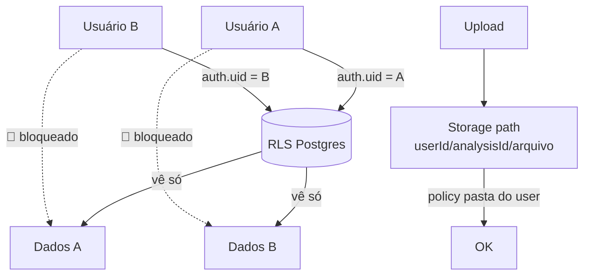

# CareerTwin

<p align="center">
  
</p>

<p align="center">
  <strong>Evolua, Reposicione e Conquiste.</strong><br/>
  Mentor digital para profissionais brasileiros em <em>recolocação</em> ou <em>transição de carreira</em>
</p>

<p align="center">
  
  
  
  
  
  
  
  
</p>

<p align="center">
  <a href="#-em-uma-frase">O que é</a> ·
  <a href="#-prd-para-product-owners">PRD</a> ·
  <a href="#-como-funciona-fluxo-do-usuário">Fluxo</a> ·
  <a href="#-arquitetura">Arquitetura</a> ·
  <a href="#-subir-localmente-passo-a-passo">Subir local</a> ·
  <a href="#-variáveis-de-ambiente">Env</a> ·
  <a href="#-limitações-honestas-do-mvp">Limitações</a>
</p>

---

## 📌 Em uma frase

> O **CareerTwin** analisa o que a pessoa **já tem** (currículo, LinkedIn, cargo-alvo e opcionalmente uma vaga) e devolve um **diagnóstico acionável**: o que melhorar, se o perfil adere ao cargo, como comunicar melhor a experiência e um **plano de evolução** — **sem prometer emprego** e **sem inventar trajetória**.

---

## 🎯 Para quem é este projeto?

| Perfil | O que encontra aqui |
|--------|---------------------|
| 👤 **Usuário final** | App web para se reposicionar no mercado com clareza |
| 🧑‍💼 **PO / PM / Designer** | PRD do MVP, escopo, o que entra / o que não entra |
| 👩‍💻 **Dev** | Como clonar, configurar Supabase, rodar e estender |
| 🧪 **QA / tester** | Fluxo feliz de ponta a ponta e limitações conhecidas |

Se você **nunca programou**, ainda consegue entender a seção [O que o produto faz](#-o-que-o-produto-faz) e o [fluxo do usuário](#-como-funciona-fluxo-do-usuário).  
Se você **quer rodar na máquina**, pule para [Subir localmente](#-subir-localmente-passo-a-passo).

---

## ✨ O que o produto faz

### ✅ Faz

- Conta + login (e-mail e senha)
- Wizard de **nova análise** (currículo, LinkedIn, cargo, vaga opcional)
- Resultado em **5 abas**: Visão geral · Recomendações · Aderência · Tradução · Plano
- Marcar recomendações e ações como **concluídas** (salva no banco)
- **Dashboard** com histórico e progresso
- **Reanálise** com comparativo de score
- Feedback “esta análise foi útil?”
- Tela de **planos freemium** (só visual no MVP — sem cobrança)
- Dados **isolados por usuário** (Row Level Security)

### ❌ Não faz (de propósito)

| Não faz | Por quê |
|---------|--------|
| Prometer contratação | Produto é mentor, não headhunter |
| Inventar experiências / métricas | Integridade e confiança |
| Scraping do LinkedIn | Só URL + texto/PDF que o usuário envia |
| Ler PDF magicamente (MVP) | Arquivo é guardado; texto da análise vem do **campo colado** ou `.txt` |
| Checkout / pagamento real | Estrutura preparada, cobrança fica para depois |
| Substituir recrutador | Apoia decisão e comunicação do candidato |

---

## 📄 PRD para Product Owners

### Visão do produto

**Nome:** CareerTwin (gêmeo de carreira — seu “twin” profissional)  
**Tipo:** B2C web  
**Mercado:** Brasil (UI 100% pt-BR)  
**Proposta de valor:** clareza de posicionamento na recolocação, com honestidade.

### Problema

Profissionais em transição:

1. Comunicam mal o que já fizeram  
2. Não sabem se o perfil “cola” no cargo/vaga  
3. Recebem conselhos genéricos ou genéricos de IA que **inventam** currículo  

### Solução (MVP)

Um fluxo guiado que transforma materiais reais em:

1. Recomendações priorizadas (currículo / LinkedIn / posicionamento)  
2. Score de aderência ao cargo e à vaga  
3. Tradução de experiência → linguagem de mercado (com alerta de autenticidade)  
4. Plano de ações com status  

### Objetivos de negócio do MVP

| Objetivo | Como medimos |
|----------|----------------|
| Validar se a análise é útil | Tabela `analysis_feedback` |
| Validar retenção do fluxo | Análises criadas + reanálises |
| Validar freemium futuro | Tela de planos + `user_credits` / `plans` |
| Validar segurança | RLS: usuário A não vê dados do B |

### Personas

1. **Recolocação operacional / administrativo** — narrativa fraca, pouca evidência  
2. **TI sênior em transição** — stack forte, posicionamento confuso no LinkedIn  
3. **Pessoa que “não sabe o cargo”** — quer 2–3 sugestões honestas de direção  

### Features prioritárias (já no código)

| # | Feature | Status MVP |
|---|---------|------------|
| 1 | Fluxo de nova análise | ✅ |
| 2 | Resultado estruturado com IA (mock / Grok / OpenAI) | ✅ |
| 3 | Dashboard + reanálise | ✅ |
| — | Auth Supabase | ✅ |
| — | Storage privado | ✅ |
| — | Planos freemium (UI) | ✅ (sem pagamento) |
| — | Extração real de PDF | ❌ (explícito na UI) |

### Regras de ouro do produto (não negociáveis)

1. Não inventar experiência  
2. Não criar métricas falsas  
3. Não prometer aprovação em vaga  
4. Diferenciar lacuna **real** × **comunicação** × **evidência**  
5. Enums no banco **sem acento** (`concluida`, `comunicacao`); rótulos com acento só na UI  

### Fora de escopo (próximas fases)

- Pagamento (Stripe etc.)  
- App mobile nativo  
- Matching com vagas em tempo real  
- Parser robusto de PDF/DOCX  
- Multi-idioma  

### Critérios de aceite (checklist do MVP)

- [x] Cadastro e login  
- [x] Criar análise com currículo + LinkedIn + cargo  
- [x] Vaga opcional  
- [x] Persistir no Supabase  
- [x] Resultado com abas  
- [x] Marcar itens como feitos  
- [x] Histórico no dashboard  
- [x] Reanálise  
- [x] RLS por usuário  
- [x] README com setup  

---

## 🔄 Como funciona (fluxo do usuário)



### As 5 abas do resultado

| Aba | O que a pessoa leva |
|-----|---------------------|
| **Visão geral** | Diagnóstico, confiança, score, cargos sugeridos (se pediu) |
| **Recomendações** | Lista priorizada + filtros + “marcar como feita” |
| **Aderência** | Score 0–100, cargo e/ou vaga, tipos de lacuna |
| **Tradução** | Original → versão mercado + alerta de autenticidade |
| **Plano** | Ações com prazo, prioridade e progresso |

---

## 🏗 Arquitetura

### Visão de alto nível



### Pipeline da análise (IA)



### Stack tecnológica (com cores 🎨)

| Camada | Tecnologia | Badge |
|--------|------------|-------|
| Framework | **Next.js 16** (App Router) |  |
| UI | **React 19** + **Tailwind CSS 4** |   |
| Linguagem | **TypeScript 5** |  |
| Auth / DB / Files | **Supabase** (Auth, Postgres, Storage) |  |
| Validação IA | **Zod** |  |
| Ícones | **Lucide React** |  |
| IA | **Mock** · **xAI Grok** · **OpenAI** |  |
| Deploy alvo | **Vercel** (+ GitHub) |  |

### Estrutura de pastas (mapa mental)

```text
CareerTwin/
├── README.md                 ← você está aqui
├── .env.example              ← modelo de variáveis (sem segredos)
├── package.json
├── supabase/
│   └── migrations/
│       └── 001_initial_schema.sql   ← rode isso no SQL Editor
└── src/
    ├── app/                  ← páginas e rotas
    │   ├── page.tsx          ← Landing
    │   ├── login/ cadastro/ recuperar-senha/
    │   ├── (app)/            ← área logada
    │   │   ├── dashboard/
    │   │   ├── analise/nova  ← wizard
    │   │   ├── analise/[id]  ← resultado
    │   │   ├── planos/
    │   │   └── configuracoes/
    │   ├── api/              ← analyze, recommendations, actions, feedback
    │   └── auth/callback/
    ├── components/           ← UI, wizard, resultado
    ├── lib/
    │   ├── ai/               ← prompts, mock, schema, Grok/OpenAI
    │   ├── supabase/         ← client / server / middleware
    │   ├── labels.ts         ← enums → pt-BR com acento
    │   └── types.ts
    └── middleware.ts         ← protege rotas logadas
```

---

## 🚀 Subir localmente (passo a passo)

> Tempo estimado: **15–25 min** na primeira vez (conta Supabase + SQL).  
> Depois: **1 min** com `npm run dev`.

### 0. O que você precisa ter instalado

| Ferramenta | Versão | Como checar |
|------------|--------|-------------|
| Node.js | 20+ (ideal 22) | `node -v` |
| npm | vem com o Node | `npm -v` |
| Conta | [supabase.com](https://supabase.com) | grátis ok |
| Git | qualquer recente | `git --version` |

Não precisa de Docker.

---

### 1. Clonar o repositório

```bash
git clone https://github.com/akamitatrush/CareerTwin.git
cd CareerTwin
npm install
```

---

### 2. Criar projeto no Supabase

1. Acesse [https://supabase.com/dashboard](https://supabase.com/dashboard)  
2. **New project** → escolha senha do banco (guarde se for usar connection string)  
3. Espere o projeto ficar **Healthy**  
4. Em **Project Settings → API**, copie:
   - **Project URL**  
   - **anon / publishable** key  

> ⚠️ Nunca use a chave **service_role** no frontend nem no app Next deste MVP.

---

### 3. Rodar o SQL (cria tabelas + segurança)

1. No Supabase: **SQL → New query**  
2. Abra o arquivo do repo:  
   `supabase/migrations/001_initial_schema.sql`  
3. **Copie tudo** → cole no editor → **Run**  

Isso cria, entre outras coisas:

- Tabelas de análise, recomendações, plano, feedback…  
- **RLS** (cada um só vê o próprio dado)  
- Bucket **privado** `career-documents`  
- Seeds de planos e jargons de mercado  

---

### 4. Configurar Auth (senão o cadastro falha)

**Authentication → Providers → Email**

| Opção | Em desenvolvimento |
|-------|--------------------|
| Enable email provider | ✅ ON |
| Confirm email | ❌ OFF (senão precisa SMTP e estoura rate limit) |

**Authentication → URL Configuration**

| Campo | Valor local |
|-------|-------------|
| Site URL | `http://localhost:3000` |
| Redirect URLs | `http://localhost:3000/auth/callback` |

---

### 5. Arquivo `.env.local`

```bash
cp .env.example .env.local
```

Edite `.env.local` (exemplo mínimo):

```env
NEXT_PUBLIC_SUPABASE_URL=https://SEU-PROJETO.supabase.co
NEXT_PUBLIC_SUPABASE_ANON_KEY=sua-chave-publishable-ou-anon
NEXT_PUBLIC_APP_URL=http://localhost:3000

# Comece com mock (não gasta API de IA)
AI_PROVIDER=mock
```

#### Opcional: IA real com Grok (xAI)

```env
AI_PROVIDER=xai
XAI_API_KEY=xai-...
XAI_MODEL=grok-3-mini
```

Chave em [console.x.ai](https://console.x.ai).  
Se a API falhar, o app **cai no mock** sozinho.

#### Opcional: OpenAI

```env
AI_PROVIDER=openai
OPENAI_API_KEY=sk-...
OPENAI_MODEL=gpt-4o-mini
```

---

### 6. Subir o app

```bash
npm run dev
```

Abra: **[http://localhost:3000](http://localhost:3000)**

Se a porta 3000 estiver ocupada:

```bash
# veja o PID e mate o processo antigo, ou use a porta que o Next sugerir
```

---

### 7. Teste do “fluxo feliz” (QA rápido)

1. **Criar conta** com e-mail tipo Gmail (alguns domínios próprios o Supabase rejeita)  
2. Dashboard → **Nova análise**  
3. Cole **texto** do currículo (importante: PDF sozinho não é lido)  
4. LinkedIn: URL + um trecho de texto  
5. Cargo + área **Desenvolvimento** + senioridade **Sênior** (se for o seu caso)  
6. **Gerar análise** → explorar abas  
7. Marcar uma recomendação como feita → recarregar → deve continuar marcada  
8. (Opcional) **Reanálise**  

---

## 🔐 Variáveis de ambiente

| Variável | Obrigatória? | Descrição |
|----------|--------------|-----------|
| `NEXT_PUBLIC_SUPABASE_URL` | ✅ | URL do projeto |
| `NEXT_PUBLIC_SUPABASE_ANON_KEY` | ✅ | Chave pública (anon/publishable) |
| `NEXT_PUBLIC_APP_URL` | ✅ | Base do app (`http://localhost:3000` ou URL Vercel) |
| `AI_PROVIDER` | recomendado | `mock` · `xai` · `grok` · `openai` |
| `XAI_API_KEY` | se `xai` | API key xAI |
| `XAI_MODEL` | não | Default `grok-3-mini` |
| `OPENAI_API_KEY` | se `openai` | API key OpenAI |
| `OPENAI_MODEL` | não | Default `gpt-4o-mini` |
| `DATABASE_URL` | não (app) | Só se for script externo de DB |

Arquivo de referência: [`.env.example`](./.env.example)

---

## 🛡 Segurança (resumo)



- Só chave **anon/publishable** no client  
- **Sem** `service_role` no código do app  
- Storage: caminho começa com o `user_id`  
- Cascade: apagar usuário remove dados relacionados  

---

## 🧠 Como a IA está organizada

Arquivo central: `src/lib/ai/generateCareerAnalysis.ts`

| Peça | Arquivo | Função |
|------|---------|--------|
| 1. System prompt | `systemPrompt.ts` | Papel + 15 regras + faixas de score |
| 2. User prompt | `userPrompt.ts` | Materiais da pessoa |
| 3. Tool / jargons | tabela `market_jargons` | Termos da área injetados no prompt |
| Schema | `schema.ts` (Zod) | Garante JSON sempre no mesmo formato |
| Mock | `mockAnalysis.ts` | Demo sem custo, determinístico |

```text
AI_PROVIDER=mock     →  sempre mock
AI_PROVIDER=xai      →  Grok; se quebrar → mock
AI_PROVIDER=openai   →  OpenAI; se quebrar → mock
```

---

## 📜 Scripts npm

| Comando | O que faz |
|---------|-----------|
| `npm run dev` | Sobe em http://localhost:3000 |
| `npm run build` | Build de produção |
| `npm run start` | Serve o build |
| `npm run lint` | ESLint |

---

## ☁️ Deploy na Vercel (visão rápida)

1. Importe o repo `akamitatrush/CareerTwin` na Vercel  
2. Configure as **mesmas env vars** do `.env.local` (Production)  
3. `NEXT_PUBLIC_APP_URL` = URL do deploy (ex. `https://careertwin.vercel.app`)  
4. No Supabase, adicione Site URL + Redirect da Vercel  
5. Deploy  

Detalhes de domínio custom (`careertwin.com` etc.) ficam para depois.

---

## ⚠️ Limitações honestas do MVP

| Limitação | Impacto | Workaround |
|-----------|---------|------------|
| PDF/DOC não são “lidos” | Análise fraca se só enviar arquivo | **Colar o texto** do currículo |
| Sem scraping LinkedIn | Precisa colar texto do perfil | Exportar PDF + colar trechos |
| Mock não é mentor sênior real | Sugestões genéricas se `AI_PROVIDER=mock` | Usar `xai` ou `openai` |
| Rate limit de e-mail Supabase free | Cadastro trava se Confirm email ON | Confirm email **OFF** em dev |
| Freemium sem cobrança | Botões “Em breve” | Normal no MVP |
| Alguns e-mails de domínio próprio | Supabase marca `email_address_invalid` | Testar com Gmail/Outlook |

---

## 🗺 Mapa de rotas

| Rota | Público? | Função |
|------|----------|--------|
| `/` | Sim | Landing |
| `/login` `/cadastro` `/recuperar-senha` | Sim | Auth |
| `/dashboard` | Não | Histórico e resumo |
| `/analise/nova` | Não | Wizard |
| `/analise/[id]` | Não | Resultado |
| `/planos` | Não | Freemium (UI) |
| `/configuracoes` | Não | Perfil |

---

## 🤝 Contribuição / uso

MVP educacional / produto em validação.  
Sinta-se livre para fork, testes e PRs — mantenha as **regras de honestidade** do produto.

---

## 📞 FAQ de 30 segundos

**“Deu Email signups are disabled”**  
→ Supabase → Auth → Providers → Email → Enable.

**“Email rate limit exceeded”**  
→ Desligue Confirm email e espere ~1h no free tier.

**“Email is invalid” no domínio da empresa**  
→ Teste com Gmail; validação do Supabase é rígida.

**“Análise de sênior de TI saiu assistente admin”**  
→ Em mock antigo acontecia; atualize o código e use área **Desenvolvimento** + **Sênior**, ou `AI_PROVIDER=xai`.

**“Posso commitar o `.env.local`?”**  
→ **Não.** Só o `.env.example`.

---

## 📚 Documentação técnica

- [Camada de IA (Fase 1, 2 e roadmap)](docs/ia.md)

## 💚 Princípio final

```text
CareerTwin não vende vaga.
CareerTwin ajuda a comunicar a trajetória real
e a decidir o próximo passo com mais clareza.
```

<p align="center">
  <sub>Feito para profissionais brasileiros · MVP · pt-BR</sub>
</p>
