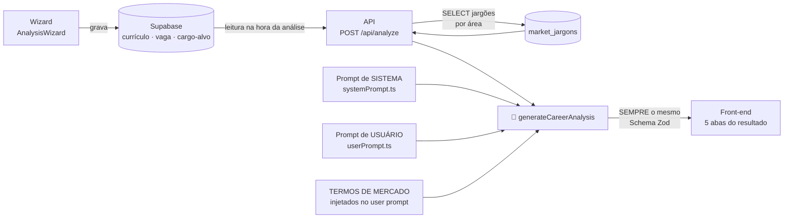
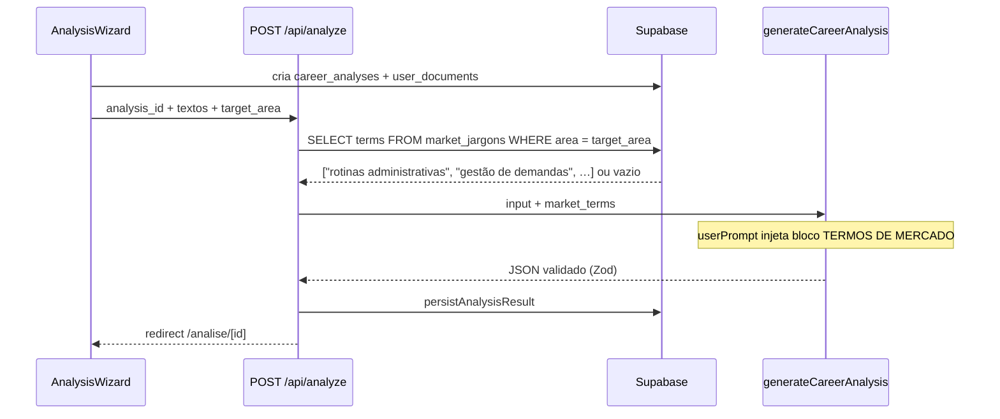
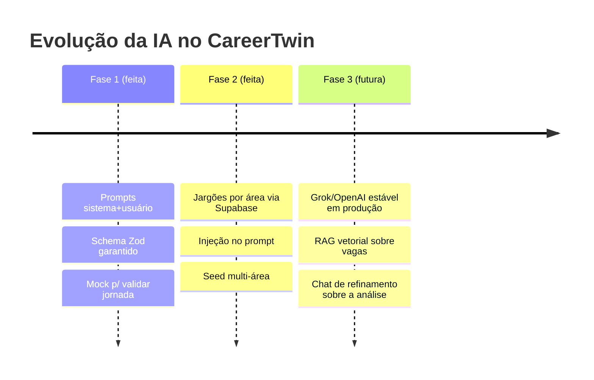

# 🧠 Camada de IA — CareerTwin

> Documento de avaliação do time, originado da mentoria Tera AI Product Leaders (07/07), **adaptado ao repositório CareerTwin**.  
> **Status:** Fase 1 ✅ implementada · Fase 2 ✅ implementada (lookup de jargões) · Fase 3 🔍 evolução (RAG / chat / produção com Grok)

---

## 1. O modelo mental do mentor: os 3 prompts

Na mentoria, a arquitetura de interação com a IA foi desenhada em três peças:

| Peça | Pergunta que responde | No CareerTwin |
| --- | --- | --- |
| **Prompt de Sistema** | *O que ela vai fazer?* — papel, regras, formato de trabalho | Persona de mentor de carreira + 15 regras de autenticidade + escalas de score + vereditos de vaga |
| **Prompt de Usuário** | *O que o usuário vai usar?* — a informação variável de cada pessoa | Currículo, LinkedIn, cargo-alvo, senioridade, vaga e complementares daquela análise |
| **Prompt de Ferramenta** | *O que a ferramenta vai retornar?* — dados externos consultados na hora | Lista de jargões da área-alvo, consultada no Supabase (`market_jargons`) na hora da análise |

O quadro desenhado em aula, formalizado para **este** código:



---

## 2. Fase 1 — Prompts estruturados + retorno em Schema JSON ✅

**Está implementada.** Cada elemento que o mentor descreveu existe no código e pode ser verificado:

| Elemento da aula | Onde está no CareerTwin | O que faz |
| --- | --- | --- |
| Captura no onboarding | `src/components/AnalysisWizard.tsx` → tabelas `career_analyses` e `user_documents` | As 8 etapas gravam os materiais no Supabase (+ Storage privado) |
| Ler do Supabase e mandar para a IA | `src/app/api/analyze/route.ts` | Autentica, valida ownership, busca jargões, chama a função de IA e persiste o resultado |
| Prompt de Sistema | `src/lib/ai/systemPrompt.ts` → `SYSTEM_PROMPT` | Papel ("mentor de carreira sênior"), as 15 regras, faixas de score e textos de recomendação final |
| Prompt de Usuário | `src/lib/ai/userPrompt.ts` → `buildUserPrompt()` | Monta o bloco variável: cargo-alvo, área, currículo, LinkedIn, vaga, complementares, termos de mercado |
| Retorno estruturado com tipos e limites | `src/lib/ai/schema.ts` → `analysisResultSchema` (Zod) | Schema com enums e tipos por campo; validação **antes** de salvar |
| "Sempre retorna este schema" | Zod + fallback mock em `generateCareerAnalysis.ts` | Se a IA real falhar ou vier fora do schema → **mock determinístico** (interface não quebra) |
| Orquestração / providers | `src/lib/ai/generateCareerAnalysis.ts` | `AI_PROVIDER=mock` \| `xai` \| `grok` \| `openai` |
| Persistência | `src/lib/ai/persistAnalysis.ts` | Grava `recommendations`, `fit_diagnostics`, `experience_translations`, `evolution_plans` |
| JSON vai para o front | Página `src/app/(app)/analise/[id]/page.tsx` + `AnalysisResult.tsx` | **5 abas:** Visão geral · Recomendações · Aderência · Tradução · Plano |

### 2.1 Tipos e limites dos campos (como o mentor pediu)

O schema restringe cada campo — a IA não tem como "inventar formato":

| Campo | Tipo | Limite/valores |
| --- | --- | --- |
| `summary.overall_score` | inteiro | 0–100 |
| `summary.confidence` | enum | `alta` · `media` · `baixa` |
| `summary.suggested_roles` | array string | 2–3 cargos se `wants_role_suggestions`; senão `[]` |
| `recommendations[].category` | enum | `competencia` · `comunicacao` · `evidencia` · `posicionamento` |
| `recommendations[].impact` / `effort` | enum | `alto` · `medio` · `baixo` |
| `recommendations[].urgency` | enum | `alta` · `media` · `baixa` |
| `fit_diagnostics[].fit_type` | enum | `cargo_alvo` · `vaga_especifica` |
| `fit_diagnostics[].score` | inteiro | 0–100 |
| `fit_diagnostics[].level` | string (faixas fixas) | Alta / Boa / Parcial / Baixa aderência |
| `fit_diagnostics[].recommendation` | texto exato | Um dos 4 vereditos da seção 12 do produto |
| `experience_translations[].authenticity_warning` | string | **Obrigatório** em toda tradução |
| `evolution_plan[].priority` | enum | `alta` · `media` · `baixa` |
| `evolution_plan[].action_type` | string | Um dos 7 tipos do plano de evolução |

**Regra de dados:** enums no banco **sempre** minúsculo e sem acento (`comunicacao`, `concluida`). Rótulos com acento só na UI (`src/lib/labels.ts`).

### 2.2 Exemplo INPUT → OUTPUT (informação variável)

**INPUT (prompt de usuário — muda a cada pessoa):**

```
CARGO-ALVO: Analista Administrativo
SENIORIDADE DESEJADA: Júnior
ÁREA: administrativo

===== CURRÍCULO =====
Assistente administrativo há 3 anos. Ajudava a equipe no dia a dia,
atendia telefone e organizava documentos. Excel básico.

===== VAGA ESPECÍFICA =====
Analista Administrativo Jr — requisitos: rotinas administrativas,
Excel intermediário, organização de processos, comunicação.
```

**OUTPUT (sempre neste schema — trecho):**

```jsonc
{
  "summary": {
    "overall_score": 68,
    "confidence": "media",
    "general_diagnosis": "Seu perfil tem boa aderência a Analista Administrativo Jr…",
    "main_strength": "Experiência real em rotinas administrativas",
    "main_gap": "Descrições genéricas escondem competências que você já tem",
    "next_best_action": "Reescrever a experiência atual detalhando demandas e ferramentas",
    "suggested_roles": []
  },
  "recommendations": [
    {
      "category": "comunicacao",
      "title": "Traduzir descrição genérica da experiência",
      "impact": "alto",
      "effort": "medio",
      "urgency": "alta",
      "description": "Não mostra quais demandas, ferramentas ou impacto.",
      "suggested_action": "Reescrever o bullet com contexto, ação e resultado real.",
      "reasoning": "Triagens e recrutadores leem competências explícitas."
    }
  ],
  "fit_diagnostics": [
    {
      "fit_type": "cargo_alvo",
      "score": 68,
      "level": "Boa aderência",
      "recommendation": "Aplicar com ajustes"
    },
    {
      "fit_type": "vaga_especifica",
      "score": 64,
      "level": "Aderência parcial",
      "recommendation": "Aplicar com ajustes."
    }
  ],
  "experience_translations": [
    {
      "original_text": "Ajudava a equipe no dia a dia.",
      "identified_issue": "Não mostra quais demandas, ferramentas ou impacto.",
      "suggested_text": "Apoio às rotinas administrativas da equipe…",
      "authenticity_warning": "Use apenas se essas atividades fizeram parte da sua experiência."
    }
  ],
  "evolution_plan": [
    {
      "action_title": "Evoluir Excel para nível intermediário",
      "action_type": "Fazer curso",
      "priority": "alta",
      "timeframe": "14 dias"
    }
  ]
}
```

Currículos diferentes, pessoas diferentes → **conteúdo** diferente, **formato** idêntico. É isso que permite o front-end renderizar as 5 abas sem nunca quebrar.

### 2.3 Como validar a Fase 1 hoje (sem custo)

O provider `mock` (padrão) produz esse mesmo schema de forma **determinística** — a jornada completa funciona sem chave de IA.

```env
AI_PROVIDER=mock
```

Ligar IA real (Grok / xAI):

```env
AI_PROVIDER=xai
XAI_API_KEY=xai-...
XAI_MODEL=grok-3-mini
```

Alternativa OpenAI:

```env
AI_PROVIDER=openai
OPENAI_API_KEY=sk-...
OPENAI_MODEL=gpt-4o-mini
```

Se a API falhar ou o JSON for inválido no Zod → fallback automático para o mock.

---

## 3. Fase 2 — Jargões por área via Supabase ✅

### 3.1 O problema que a fase resolve

A precisão terminológica depende da área: o vocabulário que valoriza um cientista de dados ("pipeline", "feature engineering") não serve para um assistente administrativo ("rotinas", "controle de demandas"). A Fase 2 dá à IA uma **lista curada de jargões da área-alvo**, vinda do Supabase, no momento da análise.

### 3.2 "Isso não seria um RAG?" — o espectro

| Degrau | Como funciona | No CareerTwin |
| --- | --- | --- |
| **A. Lookup estruturado** ⭐ | `SELECT terms FROM market_jargons WHERE area = $1` → injeta no prompt | ✅ **Implementado** |
| **B. Tool use** | A IA decide chamar `consultar_jargoes(area)` | 🔍 Evolução futura |
| **C. RAG vetorial (pgvector)** | Embeddings + busca semântica | 🔍 Quando houver base grande (ex.: vagas reais) |

**Regra de bolso:** *sabe a chave da busca → lookup; precisa buscar por significado → RAG.* A área-alvo vem do wizard → degrau A entrega 90% do valor com 10% da complexidade.

### 3.3 Como está no código (degrau A)



| Artefato | Caminho |
| --- | --- |
| Tabela + seed + RLS | `supabase/migrations/001_initial_schema.sql` (`market_jargons`) |
| Consulta na análise | `src/app/api/analyze/route.ts` |
| Injeção no prompt | `src/lib/ai/userPrompt.ts` + `GenerateAnalysisInput.market_terms` |
| Consumo no mock | `src/lib/ai/mockAnalysis.ts` (termos da área / seed) |

**Áreas seedadas:** administrativo, atendimento, dados, desenvolvimento, design, comercial, rh, marketing (com `terms[]` e `usage_note`).

**Fallback silencioso:** se a área não tiver jargões (ou a consulta falhar), a análise segue sem o bloco — mesma garantia da Fase 1.

### 3.4 Critérios de aceite da Fase 2

- [x] Tabela `market_jargons` criada com RLS e seed de várias áreas  
- [x] Análise injeta os termos no prompt (mock e providers reais)  
- [x] Mock / traduções usam termos da área quando disponíveis  
- [x] Área sem jargões: análise funciona como na Fase 1  
- [x] Regras de autenticidade continuam no system prompt  

### 3.5 O que o time ainda pode evoluir

| # | Decisão | Recomendação |
| --- | --- | --- |
| 1 | Expandir curadoria de jargões no painel Supabase | 1 dono por área (POs) |
| 2 | Degrau B (tool use) | Só se a área ficar ambígua ou multi-área |
| 3 | Degrau C (pgvector) | Quando houver corpus grande de vagas reais |

---

## 4. Providers e ambiente

| `AI_PROVIDER` | Comportamento | Chaves |
| --- | --- | --- |
| `mock` (padrão) | Determinístico, zero custo, mesmo schema | — |
| `xai` ou `grok` | Chat Completions na API xAI (Grok) | `XAI_API_KEY`, `XAI_MODEL` |
| `openai` | Chat Completions OpenAI | `OPENAI_API_KEY`, `OPENAI_MODEL` |

Arquivos: `.env.example`, `src/lib/ai/generateCareerAnalysis.ts`.

---

## 5. Roadmap da camada de IA



---

## 6. Mapa rápido de arquivos

```text
src/lib/ai/
  systemPrompt.ts           ← Peça 1 (fixo)
  userPrompt.ts             ← Peça 2 (variável)
  generateCareerAnalysis.ts ← orquestra providers + fallback
  schema.ts                 ← Zod (contrato JSON)
  mockAnalysis.ts           ← mock determinístico
  persistAnalysis.ts        ← grava no Supabase

src/app/api/analyze/route.ts   ← API da análise + lookup jargões
src/components/AnalysisWizard.tsx
src/components/AnalysisResult.tsx  ← 5 abas

supabase/migrations/001_initial_schema.sql  ← market_jargons + resto
```

---

## 7. Princípio final

```text
Mesmo schema. Conteúdo variável. Autenticidade não negociável.
Currículos diferentes → textos diferentes → formato idêntico → UI estável.
```
